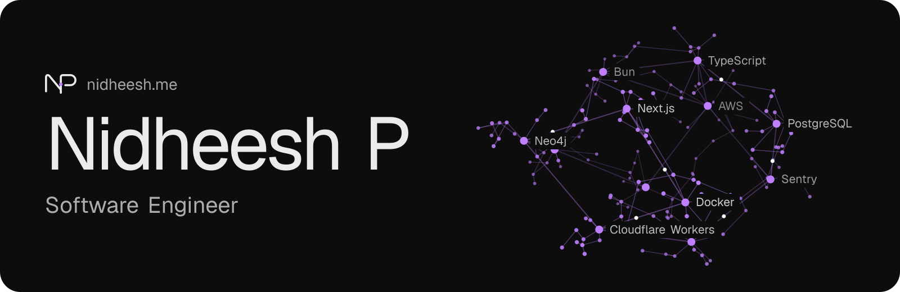

I'm a founding software engineer at [Diwalco](https://diwalco.com), working mostly on the backend: the PostgreSQL and Neo4j data model, authentication and abuse controls, realtime chat, and the CI/CD and observability that keep it shippable. I like knowing exactly how a system fails before it does.

**Open to backend and AI engineering roles**, remote, hybrid or relocation. 
[nidheesh.me](https://www.nidheesh.me) · [LinkedIn](https://www.linkedin.com/in/nidheesh-p) · [nidheesh.p@outlook.com](mailto:nidheesh.p@outlook.com)

### Selected work

**[Diwalco](https://www.nidheesh.me/work/diwalco)** · A private family-tree and family-feed platform, from the API and data model to deploy-and-rollback. Core engineer and majority contributor; the code is private, so the case study tells it.

**[Codex Guard](https://www.nidheesh.me/work/codex-guard)** · An LLM guardrail for code review that can't be talked out of its own rules. Cloudflare Workers, Workers AI and Durable Objects. [Live demo](https://codexguard.nidheesh.me)

**[react-bug-report](https://www.nidheesh.me/work/react-bug-report)** · An accessible, provider-neutral React bug-report form, dialog and widget, published on npm. [npm](https://www.npmjs.com/package/react-bug-report) · [Code](https://github.com/nidh-eesh/react-bug-report)

### At Diwalco, in production

- Average authenticated API request time from ~1.8 s to ~0.4 s, observed after adding token and user caches (not an SLO)
- CI contract gates from 3 to 12, plus a gate that checks the gates; each gate has a self-test proving it can fail
- 0 to 160 automated test files on a codebase that had none, generated with AI and reviewed by me before merge
- 10 purpose-built rate limiters; OTP sends limited by destination, not just IP

### Stack

TypeScript · Bun · Node.js · Express · PostgreSQL · Neo4j · AWS · Docker · GitHub Actions · Sentry · Cloudflare Workers

Everything I've worked with, and how deeply: [nidheesh.me/stack](https://www.nidheesh.me/stack)
